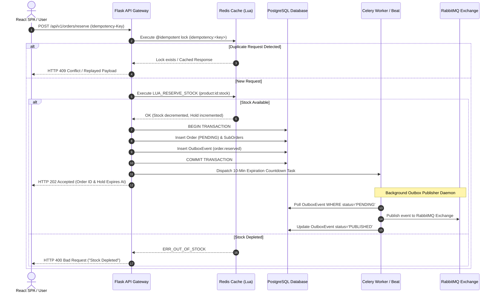

# ⚡ Flash Sale Engine & Multi-Vendor Marketplace Platform

A high-throughput, distributed e-commerce architecture designed to handle high-concurrency event-driven flash sales (thousands of requests per second for limited items) while supporting a multi-tenant multi-vendor marketplace with automated double-entry financial escrow releases and vector AI support.

---

## 📌 Executive Overview & System Architecture

```text
                               ┌─────────────────────────────────────────┐
                               │       React 18 + Vite + TypeScript      │
                               │      "Trading Floor Editorial" UI       │
                               └────────────────────┬────────────────────┘
                                                    │ REST API (JSON / JWT)
                                                    ▼
                               ┌─────────────────────────────────────────┐
                               │           Flask REST API Gateway        │
                               │   (@idempotent, @rate_limit, @jwt)     │
                               └────────┬───────────┬───────────┬────────┘
                                        │           │           │
                     ┌──────────────────┘           │           └──────────────────┐
                     ▼                              ▼                              ▼
      ┌─────────────────────────────┐┌─────────────────────────────┐┌─────────────────────────────┐
      │     Redis In-Memory Engine  ││    PostgreSQL DB Storage    ││   Celery + RabbitMQ Workers │
      │  • Atomic Lua Stock Locks   ││  • Relational Schema (ORM) ││  • Escrow Release Scheduler │
      │  • Idempotency Locks        ││  • Transactional Outbox    ││  • Outbox Relay Publisher   │
      │  • Sliding-Window Rate Limit││  • Optimistic Version Locks││  • AI RAG Auto-Responder    │
      └─────────────────────────────┘└─────────────────────────────┘└─────────────────────────────┘
```

The Flash Sale Engine decouples high-frequency inventory reservations from relational storage by leveraging **single-threaded Redis Lua scripts** for sub-millisecond stock holds, preventing database row-lock contention and Time-of-Check to Time-of-Use (TOC-TOU) race conditions. Domain events are persisted atomically via the **Transactional Outbox Pattern** to ensure strict event delivery without dual-write inconsistencies.

---

## 💻 Tech Stack Matrix

| Component | Technology | Architectural Purpose |
| :--- | :--- | :--- |
| **Frontend Framework** | React 18 + TypeScript 5 | Component-driven SPA with strict type safety. |
| **Build Tooling** | Vite 5 | Fast HMR and Rollup vendor code-splitting (`vendor`, `query`, `icons`). |
| **State & Data Fetching** | TanStack React Query v5 | Server-state caching, automatic refetching, and optimistic UI updates. |
| **Styling & UI Tokens** | Custom Vanilla CSS (v2) | "Trading Floor Editorial" design system with tabular monospace numerics. |
| **Backend REST Gateway** | Python Flask (APISpec) | Lightweight WSGI micro-framework with Marshmallow payload validation. |
| **Relational Storage** | PostgreSQL + SQLAlchemy | Persistent ACID storage with check constraints (`available_stock >= 0`) and optimistic locking. |
| **In-Memory Cache & Locks**| Redis 7 | Atomic Lua script stock holds, sliding-window rate limiting, and idempotency locks. |
| **Event Broker & Outbox** | RabbitMQ + Celery | Asynchronous background workers, Outbox daemon relay, and scheduled Celery Beat tasks. |
| **Vector AI Engine** | Vector Cosine Similarity RAG | Term-frequency vector embeddings over platform policy docs ($\ge 0.85$ auto-reply threshold). |

---

## ⚡ High-Concurrency Capabilities

1. **Sub-Millisecond Inventory Reservations (Redis Lua Scripting):** Single-threaded Lua execution guarantees atomic check-and-decrement stock holds (`product:{id}:stock` $\rightarrow$ `product:{id}:hold`), preventing overselling under heavy load.
2. **Transactional Outbox Pattern:** Ensures dual-write consistency by writing `Order` domain entities and `OutboxEvent` records in a single database transaction. A background polling daemon (`publisher.py` / `shopify_tasks.py`) pushes events to RabbitMQ/Shopify reliably.
3. **Distributed Idempotency Layer:** Decorates checkout routes (`@idempotent`) using Redis locks (`idempotency:<key>`) to eliminate duplicate order submissions during network retries.
4. **Sliding-Window Rate Limiter:** Protects endpoints (`@rate_limit`) using Redis Sorted Sets (`ZSET`) to enforce sliding-window request quotas (`10,000 req / 60s`).

---

## 🔄 Checkout & Inventory Reservation Lifecycle



---

## 📚 Complete Technical Documentation Suite (`/docs`)

Comprehensive engineering documentation is maintained in the [`docs/`](docs/) directory:

- 🧠 **[Architecture Decisions & Engineering Rationale (`docs/Decision.md`)](docs/Decision.md)**: Deep dive into the "WHY" behind Redis Lua in-memory atomic reservations, Transactional Outbox pattern, centralized `adjust_stock()` sync gateway, 7-day double-entry escrow lifecycle, counter-cache denormalization, sliding-window rate limiting, and vector AI support.
- 🔀 **[System Execution Flow & Code Tracing (`docs/flow.md`)](docs/flow.md)**: Legible, step-by-step code execution flow traces showing exact movement between files, endpoints, functions, Redis commands, SQL transactions, Celery workers, and webhooks.
- 🐛 **[Cold-Start Bug Diagnostic & Troubleshooting Guide (`docs/bug.md`)](docs/bug.md)**: Start-to-finish runbook for diagnosing, isolating, reproducing, and resolving bugs with empirical inspection checklists.
- 🚀 **[End-to-End Feature Integration Guide (`docs/feature.md`)](docs/feature.md)**: 6-phase feature engineering blueprints for adding inventory triggers (POS/TikTok Shop), Celery tasks, and secured REST API endpoints.
- 🏛️ **[System Architecture Map & Component Topology (`docs/Architecture.md`)](docs/Architecture.md)**: Complete multi-tier architecture diagram, module directory map, hot state vs. cold state table, and security topology.
- ⛔ **[System Constraints & Non-Negotiable Invariants (`docs/constraints.md`)](docs/constraints.md)**: Non-negotiable architectural boundaries, stock mutation gate, outbox dual-write gate, escrow ledger rules, and AI safety rules.
- 🔌 **[Complete REST API Reference (`docs/API.md`)](docs/API.md)**: JWT authentication, RBAC permission codes, Marshmallow JSON schemas, and courier webhook specifications.
- ⚙️ **[Concurrency Locks & Worker Topology (`docs/CONCURRENCY_AND_WORKERS.md`)](docs/CONCURRENCY_AND_WORKERS.md)**: Redis Lua scripts breakdown (`LUA_RESERVE_STOCK`, `LUA_RELEASE_STOCK`), Celery background worker tasks, sliding-window rate limiting, and `@idempotent` mechanics.
- 🗄️ **[Database Schemas & Indexing (`docs/DATABASE.md`)](docs/DATABASE.md)**: Detailed ORM entity mapping (24+ models), DB check constraints, optimistic version locking, composite index strategies, and `message_count` counter-cache denormalization.
- 🛍️ **[Shopify Integration Guide (`docs/SHOPIFY_INTEGRATION_GUIDE.md`)](docs/SHOPIFY_INTEGRATION_GUIDE.md)**: Operational guide for linking Shopify stores, access tokens, webhooks, and automatic stock sync.

---

## 🚀 Quickstart Guide

### Prerequisites
- Python 3.10+
- Node.js 18+
- PostgreSQL 14+
- Redis 7+
- RabbitMQ 3+ (Optional for Celery Outbox relay)

### 1. Start Backend REST API
```powershell
# Navigate to backend
cd backend

# Create and activate Python virtual environment
python -m venv .venv
.\.venv\Scripts\activate

# Install Python dependencies
pip install -r requirements.txt

# Start Flask WSGI server
python wsgi.py
```
> REST API running at **http://localhost:5000**.  
> Interactive Swagger OpenAPI docs available at **http://localhost:5000/docs**.

### 2. Start Frontend Application
```powershell
# Navigate to frontend
cd frontend

# Install Node modules
npm install

# Run Vite dev server
npm run dev
```
> React SPA running at **http://localhost:5173**.

### 🔑 Default Platform Credentials
- **Super Admin:** `admin@flashsale.com` / `Password123`
- **Vendor Account:** `vendor@flashsale.com` / `Password123`
- **Customer Account:** `customer@flashsale.com` / `Password123`

### 🧪 Run Automated Verification Tests
```powershell
# Run Backend Pytest Suite
cd backend
.venv\Scripts\python.exe -m pytest tests/

# Run Frontend TypeScript Compilation Check
cd frontend
cmd /c npx tsc --noEmit
```
