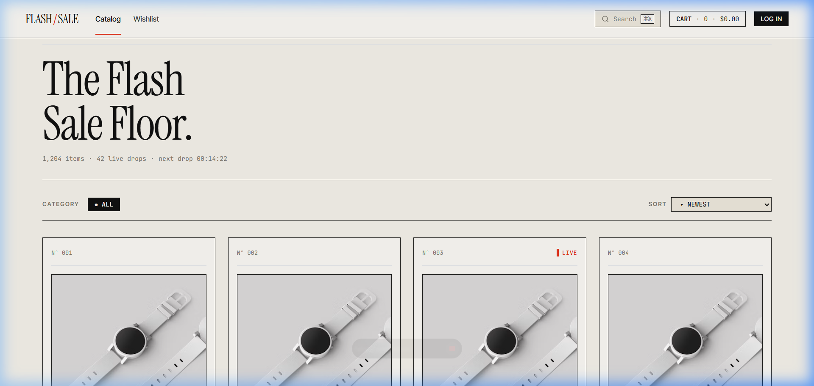
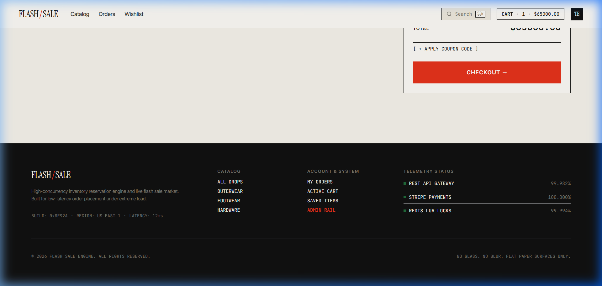
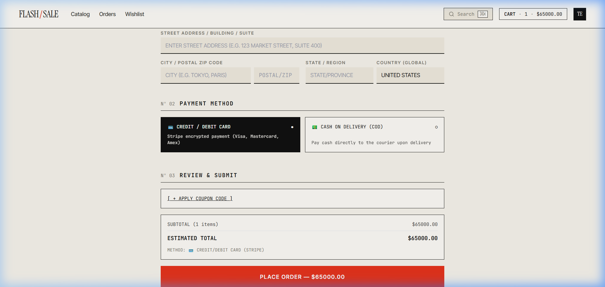

# ⚡ High-Scale Flash Sale Engine & Distributed Multi-Outlet E-Commerce Platform

A production-grade, full-stack distributed e-commerce platform and high-concurrency inventory reservation engine. Designed around **Frontend Design Specification v2 ("Trading Floor Editorial")** using **React 18 + Vite + TypeScript** and backed by an event-driven **Flask + PostgreSQL + Redis + RabbitMQ + Celery** microservice architecture.

---

## 🎨 Visual Interface Showcase

### 🛍️ 1. Floor Catalog & Real-Time Drops (`/products`)

*High-density 4-column product grid featuring issue counters (`Nº 001`), live signal dots, monospace stock block gauges (`▓▓▓▓▓░░░`), category filters (`● ALL`, `FOOTWEAR`, `TECH`), inline variant color swatches, and zero-padded tabular prices (`$099.99`).*

---

### 🛒 2. Cart & Reserved Inventory Hold Timer (`/cart`)

*Active inventory reservation hold timer featuring real-time digit-flip countdown, `localStorage` persistence across page refreshes, promo coupon code validation with usage hints, and sticky order subtotal summary.*

---

### 💳 3. Multi-Channel Checkout & Worldwide Shipping (`/checkout`)

*Single-column 720px stack with **Worldwide Shipping Address** entry (covering 200+ UN ISO countries & territories with free-form autocomplete), payment method selector (**Credit/Debit Card** & **Cash on Delivery / COD**), and one-click test card auto-fill.*

---

### 🏢 4. Hierarchical Approval Pipeline & Multi-Tenant Control (`/admin`)

*Role-gated Admin Control Floor featuring multi-outlet RBAC, onboarding approval pipeline, user directory deletion controls, dynamic custom role generator, promo coupon rules engine, and stock ledger telemetry.*

---

## 📁 Repository Structure

```text
flash-sale-engine/
├── backend/                  # Python Flask REST API & Async Workers
│   ├── app/                  # Application core, blueprints, models, schemas, services
│   │   ├── api/v1/           # Auth, Products, Cart, Orders, Approvals, RBAC, Outlets, Commerce, Webhooks
│   │   ├── core/             # DB extensions, config, security, rate limiting, RBAC authorization
│   │   ├── models/           # SQLAlchemy ORM models (Product, Order, User, Tenant, Outlet, Approval, RBAC, Coupon, CouponRedemption)
│   │   ├── schemas/          # Marshmallow validation schemas
│   │   └── services/         # MultiOutletService, InventoryService, OrderService, PaymentService
│   ├── tests/                # Automated pytest suite
│   ├── wsgi.py               # WSGI server entry point
│   ├── requirements.txt      # Python dependencies
│   └── README.md             # Backend architecture documentation
│
└── frontend/                 # React 18 + Vite + TypeScript SPA
    ├── public/screenshots/   # Visual interface documentation screenshots
    ├── src/
    │   ├── api/              # Typed REST client wrappers (Auth, Products, Cart, Orders, Admin, Commerce)
    │   ├── components/       # UI components (Navbar, Footer, ProductCard, VariantPicker, ReviewForm, CouponInput, StripeForm)
    │   ├── context/          # AuthContext session management & Bearer token handling
    │   ├── hooks/            # TanStack React Query state management hooks
    │   ├── pages/            # Public & protected views + Admin Portal sub-routes
    │   └── types/            # Generated OpenAPI types & domain interfaces
    ├── package.json          # Node dependencies
    └── vite.config.ts        # Vite build & local proxy server configuration
```

---

## 🔥 Key System Capabilities

### 🏢 1. Dynamic RBAC & Multi-Tenant Enterprise Scope
* **Dynamic Custom Role Generator:** Create custom organizational roles (e.g., `Store Manager`, `Stock Auditor`, `Vendor Specialist`) and bind granular permission codes dynamically.
* **Granular Permission Matrix:** Enforces 9+ permission scopes (`outlet:stock:read`, `outlet:stock:write`, `outlet:staff:approve`, `enterprise:roles:read`, `enterprise:roles:write`, `enterprise:roles:assign`, `enterprise:orders:manage`, `enterprise:products:manage`, `enterprise:coupons:manage`).
* **Hierarchical Approval Chain:** Onboarding pipeline for Managers (`MANAGER_ONBOARDING`), Staff (`STAFF_ONBOARDING`), and Vendors (`VENDOR_REGISTRATION`). Approvals assign targeted roles and store outlet scopes automatically upon approval.
* **Hierarchical User Deletion:** Super Admins can manage and delete any vendor or staff account, while store managers can delete staff within their assigned outlet scope.
* **Outlet Isolation:** Multi-outlet inventory ledger (`Flash Engine FSD` & `Flash Engine LHR`) with atomic inter-outlet stock transfers.

### 🎟️ 2. Advanced Promotional Coupon Engine
* **Global Usage Limit ("First N Users"):** Set global redemption caps (e.g., valid for the first 50 customers). Automatically deactivates (`AUTO-DEACTIVATED`) once the limit is reached.
* **Per-User Usage Limit:** Configure maximum allowed redemptions per customer account (e.g., 1 use per account). Redemptions are tracked via the `CouponRedemption` ledger.
* **Pause / Resume & Deletion Controls:** Instant status toggles (`PAUSE ⏸` / `RESUME ▶`) and soft/hard deletion (`DELETE ✕`) from the Admin Floor.
* **Cart Hint Badges:** Real-time feedback in the cart UI displaying active discount amounts and usage restriction hints.

### 🛒 3. "Trading Floor Editorial" Design System (`/frontend`)
* **Editorial Aesthetic Tokens:** Built with Instrument Serif, Inter Tight, and JetBrains Mono. Flat paper surfaces (`--paper`, `--bone`, `--paper-sunk`), hairline borders (`1px solid var(--rule)`), and Signal Red (`#E5321B`) CTAs.
* **Tabular Monospace Numerics:** All prices, stock counts, order SKUs, and timers use `font-variant-numeric: tabular-nums` with zero-padded formatting (`$099.99`).
* **Session Persistence:** Session persistence across page refreshes via `/api/v1/auth/me` token validation.
* **Delivery-Gated Product Reviews:** Verified purchase eligibility check preventing users from leaving product reviews unless they have a verified delivered order.
* **Product Variant Swatches:** Inline color swatches and size selector options (`S`, `M`, `L`, `XL`) linked directly to stock ledger variants.

### ⚡ 4. High-Concurrency Distributed Backend (`/backend`)
* **Redis Lua Atomic Stock Lock:** High-concurrency inventory holds executed atomically via Redis Lua scripts to eliminate race conditions and database row locking.
* **Transactional Outbox Pattern:** Ensures atomic database updates by writing domain models (`Order`) and event payloads (`OutboxEvent`) within a single PostgreSQL transaction.
* **Async Workers & Event Broker:** Outbox publisher relays events to **RabbitMQ**, consumed by **Celery** workers for Stripe PaymentIntents and 10-minute hold expirations.
* **Interactive OpenAPI Specs:** Swagger UI documentation available at `http://localhost:5000/docs`.

---

## 🚦 Quickstart Guide

### Prerequisites
- **Node.js** (v18+)
- **Python** (v3.10+)
- **Redis** & **PostgreSQL** (running locally or via Docker)

---

### Step 1: Start the Backend API

```powershell
# Navigate to backend directory
cd backend

# Activate virtual environment
.\.venv\Scripts\activate   # On Windows
# source .venv/bin/activate  # On Linux/macOS

# Run WSGI server
python wsgi.py
```
> The Flask REST API starts at **[http://localhost:5000](http://localhost:5000)**.
> Swagger API docs are interactive at **[http://localhost:5000/docs](http://localhost:5000/docs)**.

---

### Step 2: Start the Frontend Application

Open a second terminal window:

```powershell
# Navigate to frontend directory
cd frontend

# Install Node dependencies
npm install

# Start Vite dev server
npm run dev
```
> The React application starts at **[http://localhost:5173](http://localhost:5173)**.

---

## 🔑 Default Credentials

- **Super Admin Account:**
  - **Email:** `admin@flashsale.com`
  - **Password:** `Password123`

---

## 🧪 Verification & Automated Tests

### Frontend TypeScript Verification
```powershell
cd frontend
cmd /c npx tsc --noEmit
```

### Backend Automated Test Suite
```powershell
cd backend
pytest -v
```

---

## 📄 License
Distributed under the MIT License. Built for high-scale e-commerce & flash sale applications.
