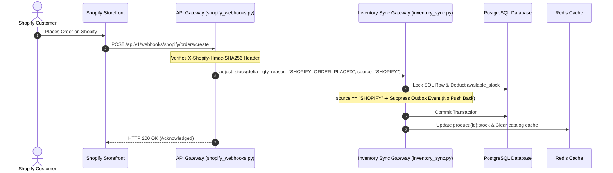
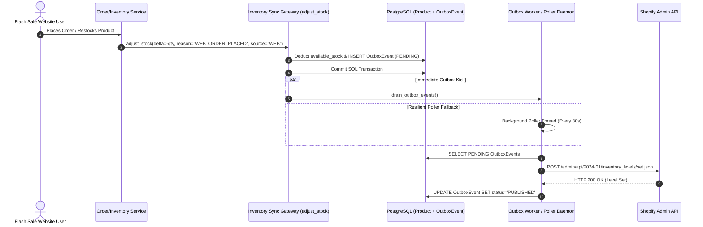

# 🛍️ Master Shopify Integration Guide: Operations & Technical Architecture

> **Target Audience:** Operations Teams, Store Owners, Software Engineers & System Administrators  
> **System Scope:** Bidirectional Real-Time Synchronization, High-Scale Concurrency, Transactional Outbox Resilience  
> **Document Version:** 3.0 (Includes Resilient Outbox Poller & Multi-Channel Stock Gateway)

---

## 📑 Executive Table of Contents
1. [🌟 1. System Overview & Real-Time Sync Capabilities](#-1-system-overview--real-time-sync-capabilities)
2. [🔐 2. Step-by-Step Store Setup & Credentials Guide](#-2-step-by-step-store-setup--credentials-guide)
3. [🔔 3. Webhook Infrastructure & Endpoint Configuration](#-3-webhook-infrastructure--endpoint-configuration)
4. [🏗️ 4. Integration Architecture & Data Flow Diagrams](#️-4-integration-architecture--data-flow-diagrams)
   - [Flow A: Shopify Purchase ➔ Flash Sale Engine Sync](#flow-a-shopify-purchase--flash-sale-engine-sync-incoming-webhook)
   - [Flow B: Flash Sale Engine Change ➔ Push to Shopify API](#flow-b-flash-sale-engine-change--push-to-shopify-api-outbox-drainage)
5. [🔄 5. Transactional Outbox Pattern & Background Poller Topology](#-5-transactional-outbox-pattern--background-poller-topology)
6. [🛑 6. Infinite Loop Suppression & Origin Rules](#-6-infinite-loop-suppression--origin-rules)
7. [🗺️ 7. Codebase Directory & File Map](#️-7-codebase-directory--file-map)
8. [❓ 8. Troubleshooting & Diagnostic Runbook](#-8-troubleshooting--diagnostic-runbook)

---

## 🌟 1. System Overview & Real-Time Sync Capabilities

**Flash Sale Engine** connects directly to your **Shopify Store** via the Shopify Admin API (REST/GraphQL) and Webhooks. Stock changes on either platform are mirrored across database tables (PostgreSQL), in-memory speed caches (Redis), and Shopify inventory levels without overselling.

```
       ┌────────────────────────┐              ┌────────────────────────┐
       │   Flash Sale Website   │              │     Shopify Store      │
       │   & Admin Dashboard    │ ◄──────────► │    Admin & Checkout    │
       └────────────────────────┘              └────────────────────────┘
                   │                                       │
                   └───────────────────┬───────────────────┘
                                       ▼
                        🔄 Real-Time Bidirectional Sync
                        • Web Checkouts & Guest Purchases
                        • Shopify Admin & Storefront Orders
                        • Order Expirations & Order Cancellations
                        • Customer Refunds & Admin Restocks
                        • Catalog Product & Variant Sync
```

### Key Guarantees
- **Zero Overselling:** Atomic Redis Lua holds protect high-concurrency website checkouts ($> 10,000\text{ req/sec}$).
- **Zero Data Drift:** PostgreSQL `adjust_stock()` gateway enforces dual-writes via the Transactional Outbox pattern.
- **Resilient Recovery:** Background outbox daemon poller automatically retries failed syncs without blocking HTTP user checkout threads.

---

## 🔐 2. Step-by-Step Store Setup & Credentials Guide

### Phase 1: Get Credentials from Shopify Admin (5 Minutes)

#### Step 1.1: Log into your Shopify Admin
1. Open your Shopify Admin URL (e.g., `https://flash-sale-21466.myshopify.com/admin`).
2. Log in using store owner credentials.

#### Step 1.2: Enable Custom App Development
1. Click **Settings** (gear icon at the bottom left).
2. Select **Apps and sales channels** from the left navigation bar.
3. Click **Develop apps** (top right button).
4. Confirm **Allow custom app development** if prompted.

#### Step 1.3: Create App & Configure Admin API Scopes
1. Click **Create an app**.
2. App Name: `Flash Sale Engine Sync`.
3. Select Developer Email and click **Create app**.
4. Click **Configure Admin API scopes** under *Overview*.
5. Select the following mandatory permissions:
   - ✅ `read_products` & `write_products`
   - ✅ `read_inventory` & `write_inventory`
   - ✅ `read_orders` & `read_all_orders`
   - ✅ `read_locations`
   - ✅ `read_customers`
   - ✅ `read_fulfillments` & `write_fulfillments`
6. Click **Save**.

#### Step 1.4: Install App & Copy Access Token
1. Open the **API credentials** tab.
2. Click **Install app** and confirm.
3. Under **Admin API access token**, click **Reveal token once**.
4. ⚠️ **Copy this token immediately** (`shpat_...`). It will only be shown once!

---

### Phase 2: Configure Environment Variables

Add your Shopify keys to your `.env` configuration file in `backend/`:

```env
# -----------------------------------------------------------------
# SHOPIFY INTEGRATION SETTINGS
# -----------------------------------------------------------------
SHOPIFY_SHOP_DOMAIN=flash-sale-21466.myshopify.com
SHOPIFY_ACCESS_TOKEN=shpat_your_token_from_step_1_4
SHOPIFY_API_VERSION=2024-01
SHOPIFY_LOCATION_ID=80021225539
SHOPIFY_WEBHOOK_SECRET=shpss_your_webhook_secret_from_step_3
```

> **How to Find Location ID:** Go to Shopify Admin ➔ **Settings ➔ Locations** ➔ Click your location name. The trailing digits in your browser URL (`.../locations/80021225539`) are your `SHOPIFY_LOCATION_ID`.

---

## 🔔 3. Webhook Infrastructure & Endpoint Configuration

Webhooks inform Flash Sale Engine instantly whenever customers place orders or request refunds directly on Shopify.

### Webhook Setup Instructions
1. In Shopify Admin, navigate to **Settings ➔ Notifications ➔ Webhooks**.
2. Create the following two webhooks:

| Webhook Event | Format | Callback URL |
| :--- | :--- | :--- |
| **Order creation** | `JSON` | `https://your-domain.com/api/v1/webhooks/shopify/orders/create` |
| **Refund creation** | `JSON` | `https://your-domain.com/api/v1/webhooks/shopify/refunds/create` |

3. Copy the **HMAC Secret Key** listed at the bottom of the Shopify Webhooks page and paste it into `SHOPIFY_WEBHOOK_SECRET` in `.env`.

---

## 🏗️ 4. Integration Architecture & Data Flow Diagrams

### Flow A: Shopify Purchase ➔ Flash Sale Engine Sync (Incoming Webhook)



---

### Flow B: Flash Sale Engine Change ➔ Push to Shopify API (Outbox Drainage)

Traced when a web order is placed (`WEB_ORDER_PLACED`), refunded (`WEB_ORDER_REFUNDED`), cancelled (`WEB_ORDER_CANCELLED`), or restocked by an admin (`ADMIN_STOCK_EDIT`).



---

## 🔄 5. Transactional Outbox Pattern & Background Poller Topology

### Dual-Write Resilience Problem
Directly invoking the Shopify REST API inside database HTTP request handlers creates severe risks:
1. **Network Failure / Rate Limits:** If Shopify returns an HTTP 429 or drops connection after PostgreSQL commits, database stock and Shopify stock silently drift apart.
2. **Slow Checkout Latency:** Calling external APIs during checkout adds $300\text{--}1500\text{ ms}$ latency to every user order.

### Solution: Transactional Outbox + Background Poller

1. **Transactional Outbox (`OutboxEvent`):**
   - Stock adjustments write an `OutboxEvent` (`aggregate_type="PRODUCT"`, `event_type="INVENTORY_ADJUSTED"`) inside the **exact same PostgreSQL transaction** as `Product.available_stock`. Either both persist or both roll back.

2. **Immediate Synchronous Drain:**
   - [`adjust_stock()`](file:///d:/Flash%20Sale%20Engine/backend/app/services/inventory_sync.py#L167-L173) immediately invokes [`drain_outbox_events()`](file:///d:/Flash%20Sale%20Engine/backend/app/workers/shopify_tasks.py#L104-L163) for sub-second synchronization under normal conditions.

3. **Resilient In-Process Poller Thread (`start_outbox_poller`):**
   - Implemented in [`backend/app/workers/shopify_tasks.py`](file:///d:/Flash%20Sale%20Engine/backend/app/workers/shopify_tasks.py#L14-L45) and initialized on Flask startup (`app/__init__.py`).
   - Runs every 30 seconds (`_POLL_INTERVAL_SECONDS = 30`), picking up any `PENDING` or previously failed outbox events and pushing them to Shopify.
   - Requires no external Celery worker processes to guarantee eventual consistency.

---

## 🛑 6. Infinite Loop Suppression & Origin Rules

### The Ping-Pong Loop Risk
Without origin tracking, a Shopify purchase would trigger a webhook $\rightarrow$ Flash Sale updates stock $\rightarrow$ Flash Sale sends stock update to Shopify $\rightarrow$ Shopify triggers webhook $\rightarrow$ **Infinite Update Loop**.

### Strict Control Gateway Rules

In [`backend/app/services/inventory_sync.py`](file:///d:/Flash%20Sale%20Engine/backend/app/services/inventory_sync.py):

```python
_SHOPIFY_ORIGIN_SOURCES = {"SHOPIFY"}

should_push_to_shopify = (
    source not in _SHOPIFY_ORIGIN_SOURCES
    and product is not None
    and (
        product.is_listed_on_shopify
        or bool(product.shopify_inventory_item_id or product.shopify_product_id)
    )
)
```

| Source Tag | Origin Context | Generates `OutboxEvent`? | Pushes to Shopify? |
| :--- | :--- | :---: | :---: |
| `source="WEB"` | Web Checkout, Guest Purchase, Cart Restoration | ✅ **YES** | ✅ **YES** |
| `source="ADMIN"` | Admin Dashboard Stock Edit | ✅ **YES** | ✅ **YES** |
| `source="SHOPIFY"` | Incoming Shopify Order / Refund Webhook | ❌ **NO (Suppressed)** | ❌ **NO** |

---

## 🗺️ 7. Codebase Directory & File Map

| File Path | Role & Responsibilities |
| :--- | :--- |
| [`backend/app/services/inventory_sync.py`](file:///d:/Flash%20Sale%20Engine/backend/app/services/inventory_sync.py) | **Central Inventory Gateway:** Exclusive method `adjust_stock()` managing SQL row locks, Redis mirroring, and outbox creation. |
| [`backend/app/workers/shopify_tasks.py`](file:///d:/Flash%20Sale%20Engine/backend/app/workers/shopify_tasks.py) | **Sync Worker & Poller Daemon:** Outbox drain engine (`drain_outbox_events`), product sync tasks, and background thread (`start_outbox_poller`). |
| [`backend/app/integrations/shopify/client.py`](file:///d:/Flash%20Sale%20Engine/backend/app/integrations/shopify/client.py) | **Shopify REST API Client:** Low-level HTTP requester with automatic HTTP 429 rate-limit backoff (`set_inventory_level`, `create_product`). |
| [`backend/app/integrations/shopify/sync.py`](file:///d:/Flash%20Sale%20Engine/backend/app/integrations/shopify/sync.py) | **Product Sync Service:** Maps local `Product` and `ProductVariant` models to Shopify Admin API payloads (`sync_product`, `sync_inventory`). |
| [`backend/app/integrations/shopify/mapper.py`](file:///d:/Flash%20Sale%20Engine/backend/app/integrations/shopify/mapper.py) | **Data Payload Mapper:** Converts internal database models to Shopify REST JSON schemas. |
| [`backend/app/api/v1/shopify_webhooks.py`](file:///d:/Flash%20Sale%20Engine/backend/app/api/v1/shopify_webhooks.py) | **Webhook Receiver:** HMAC signature validator and endpoint handler for Shopify `order.created` and `refund.created`. |
| [`backend/app/services/order_service.py`](file:///d:/Flash%20Sale%20Engine/backend/app/services/order_service.py) | **Order Lifecycle:** Executes single/multi/guest checkouts and `refund_order()`, routing all stock adjustments through `adjust_stock()`. |

---

## ❓ 8. Troubleshooting & Diagnostic Runbook

### 1. Shopify stock does not update after a website sale
- **Inspection Command (SQL):**
  ```sql
  SELECT id, aggregate_id, event_type, status, retry_count, error_log, created_at 
  FROM outbox_events 
  WHERE status = 'PENDING' 
  ORDER BY created_at DESC LIMIT 10;
  ```
- **Diagnostic Cause:** The background poller may be paused or external Shopify API credentials failed.
- **Manual Kick Command:**
  ```bash
  python -c "from app.workers.shopify_tasks import drain_outbox_events; print(drain_outbox_events())"
  ```

### 2. Shopify returns `HTTP 429 Too Many Requests`
- **Behavior:** `ShopifyClient` automatically catches 429 responses, inspects the `Retry-After` HTTP header, sleeps, and retries up to 3 times automatically.

### 3. Product shows `[UNPUBLISHED]` on Admin Dashboard
- **Explanation:** Products newly created locally remain unpublished to Shopify until an admin toggles the sync switch.
- **Action:** Open Admin Dashboard ➔ Catalog ➔ Click **SHOPIFY SYNC** toggle. This executes `ShopifySyncService.sync_product()`, creating the product, variants, and inventory items on Shopify.

### 4. How do I verify zero stock drift across platforms?
- Run the stock invariant check in SQL and Redis:
  $$\text{Redis Stock Key (`product:ID:stock`)} == \text{PostgreSQL `available_stock`} == \text{Shopify Available Qty}$$

---

*Document Version: 3.0 | Built for High-Scale Enterprise Concurrency & Reliable Shopify Synchronization.*
